# 计算机网络笔记

#### @author:ChenXF

## [学习链接](https://www.bilibili.com/video/BV19E411D78Q?p=1)

## 1  三大模型

#### 1.1 OSI参考模型

```
应用层							应用层
表示层							表示层
会话层							会话层
传输层							传输层
网络层							网络层
数据链路层					   数据链路层
物理层		---------------->	物理层
```

#### 1.2 TCP/IP参考模型      TCP/IP协议栈

```
应用层					HTTP|FTP|DNS
传输层					TCP  	UD
网际层					IP	
网络接口层			   Ethernet ATM Frame Relay	
```

#### 1.3 5层参考模型

```
应用层						应用层
传输层  					传输层
网络层						网络层
数据链路层				   数据链路层
物理层 	------------->	物理层
```

## 2  物理层

#### 2.1 通信基础

		##### 2.1.1三大特性

```
1、机械特性：物理特性，比如引脚数目、接口性状等
2、电气特性：传输二进制位是，线路上的电压范围、阻抗匹配、传输速率、距离限制等
3、功能特性：电平意义、接口部件的信号线用途
```

##### 2.1.2  数据通信

##### *典型的数据通信模型

```
电脑————————>调制解调器————————>公用电话网————————>调制解调器————————>电脑
	数字信号		   模拟信号			  模拟信号			数字信号
	
*———————————————————————————————————————————————————————————————————————————————————————*	
——————>信源——————>发送器————————>传输系统————————>接收器——————>信宿——————>
输入信息	输入数据	 发送的信号		 接受的信号		输出数据	输出信息

```

##### *数据通信相关术语

```
数据：传送信息的实体，通常是有意义的符号序列
信号：数据的电气/电磁的表现，是数据在传输过程中的存在形式
	数字信号：代表消息的参数取值是离散的。_|-|_|-|_
	模拟信号：代表消息的参数取值是连续的。~v~v~v~v~
信源：产生和发送数据的源头
信宿：接收数据的终点
信道：信号的传输媒介。一般用来表示向某一个方向传送信息的介质，因此一条通信线路往往包含一条发送信道和一条接收信道
```

##### *三种通信方式

```
1、单工通信：只有一个方向的通信而没有反方向的交互，仅需要一条信道
2、半双工通信：通信的双方都可以发送或接收消息，但任何一方都不能同时发送和接收，需要两条信道
3、全双工通信：通信双方可以同时发送和接受信息，也需要两条信道
```

##### *两种数据传输方式

```
串行传输：速度慢，费用低，适合远距离
发			   接
送 0101011101010收
方			   方
并行传输：速度快，费用高，适合近距离（用于计算机内部数据传输）
   1->
发 0->  接
送 1 -> 收
方 0->  方
   1->
```

##### 2.1.3码元、波特、速率、宽带

##### *码元

```简体中文
码元是指用一个固定时长的信号波形（数字脉冲），代表不同离散数值的基本波形，是数字通信中数字信号的计量单位，这个时长内的信号称为K进制码元，而该时长称为码元宽度。当码元的离散状态有M个时（M大于2），此时码元为M进制码元。
```

```
1码元可以携带多个比特的信息量。例如，在使用二进制编码时，只有两种不同的码元，一种代表0状态，另一种代表1状态。
_|-|_|-|_|-|_
0101010101010
```

```
K进制码元————4进制码元————码元的离散状态有4个————4种高低不同的信号波形————00、01、10、11
```

##### *速率

速率也叫数据率，是指数据的传输速率，表示单位时间内传输的数据量。可以用码元传输速率和信息传输速率表示。

###### 1s传输多少个码元

```
1）码元传输速率：别名码元速率、波形速率、调制速率、符号速率等，它表示单位时间内数字通信系统所传输的码元个数（也可称为脉冲个数或信号变化的次数），单位是波特（Baud）。1波特表示数字通信系统Meiz每秒传输一个码元。这里的码元可以是多进制的，也可以是二进制的，但码元速率与进制数无关。
```

###### 1s传输多少个比特

```
2）信息传输速率：别名信息速率、比特率等，表示单位时间内数字通信系统传输的二进制码元个数（即比特数），单位是比特/秒（b/s）。
```

###### 关系

```
若一个码元携带n bit的信息量，则M Baud的码元传输速率所对应的信息传输速率为MXn bit/s。
```

##### *带宽

```
表示单位时间内从网络中的某一点到另一点所能通过的“最高数据率”，常用来表示网络的通信线路所能传输数据的能力。单位是b/s。
```

##### 2.1.2  奈氏准则/香农定理

##### *奈氏准则

```
在理想低通（无噪声，带宽受限）条件下，为了避免码间串扰，极限码元传输速率为2W Baud，W是信道带宽，单位是Hz。
```

```
理想低通信道下的极限数据传输率=2Wlog2V（b/s）
W：带宽（Hz）
V：码元的离散电平数目
```

```
1、在任何信道中，码元传输的速率是有上限的，若传输速率超过此上限，就会出现严重的码间串扰问题，使接受端对码元 的完全正确识别成为不可能。
2、信道的频带越宽（即能通过的信号高频分量越多），就可以用更高的速率进行码元的有效传输。
3、奈氏准则给出了码元传输速率的限制。但并没有对信息传输速率给出限制。
4、由于码元的传输速率受奈氏准则的限制，所以要提高数据的传输速率，就必须设法使每个码元能携带更多个比特的信息量，这就需要采用多元制的调制方法。
```

##### *香农定理

###### 信噪比

```
噪声存在于所有的电子设备和通信信道中。由于噪声随机产生，它的瞬时值有时会很大，因此噪声会使接收端对码元的判决产生错误。但是噪声的影响是相对的，若信号较强，那么噪声影响相对较小。因此，信噪比就很重要。
信噪比=信号的平均功率/噪声的平均功率。常记为S/N，并用分贝（dB）作为度量单位，即：
信噪比（dB）=10lg（S/N） 数值等价
```

###### 香农定理

```
在带宽受限且有噪声的信道中，为了不产生误差，信息的数据传输速率有上限值。
信道的极限数据传输速率=Wlog2(1+S/N)(b/s)
W:带宽（Hz）
S/N：信噪比（S是信道所传信号的平均功率）（N是信道内的高斯噪声功率）
```

```
1、信道的带宽或信道中的信噪比越大，则信息的极限传输速率就越高
2、对一定的传输带宽和一定的信噪比，信息传输速率的上限就确定了
3、只要信息的传输速率低于信道的极限传输速率，就一定能找到某种方法来实现无差错的传输。
4、香农定理得出的为极限信息传输速率，实际信道能达到的传输速率要比它低不少。
5、从香农定理可以看出，若信道带宽W或信噪比S/N没有上限（不可能），那么信道的极限信息传输速率也就没有上限。
```

### 3.1 数据链路层功能概述

结点：主机、路由器

链路：物理通道

数据链路：逻辑通道

帧：传输的最小单元

功能：无确认无连接，有确认无连接、有确认有连接

### 3.2封装成帧和透明传输

透明传输：帧看不见自己发送的什么

1、字符计数法（容易出错）

2、字符填充法：SOH-装在帧中的数据部分-EOT

3、零比特填充法：5110，遇到5个1填充一个0

4、违规编码方式：比如曼彻斯特编码

### 3.3.2 差错控制

差错：位错：10反了，帧错：丢失、重复、失序

差错控制：检错编码、纠错编码

### 3.4.1 流量控制与可靠传输机制

较高的发送速度和较低的接受能力的不匹配

数据链路层：接收端不发送就不会发

传输层：发送流量窗口给发送端

停止等待协议：发送窗口1，接收窗口1

GBN协议：发送窗口＞1，接收窗口1

SR协议：发送窗口＞1，接收窗口＞1

### 3.4.2 停止等待协议

无差错情况：

有差错情况：超时计时器，超时重传

ACK丢失：超时计时器，超时重传，丢弃重复帧

ACK迟到：丢弃重复帧

信道利用率：发送时间占整个发送周期的比例

### 3.4.2 SR选择重传协议

两个窗口

发送方的窗口的最低被受到确认后才能往右滑动

接收方同理

Wmax=Wmin=pow(2,n-1)

### 3.4.2 后退N帧协议

1、上层的调用

2、收到了一个ACK

3、超时事件

（GBN协议）

### 3.5.1 信道划分介质访问控制

点对点：常用于广域网

广播式：

局域网

典型的拓扑结构：总线型、星型

介质访问控制：

静态划分信道：信道划分介质访问控制

（FDM :并行

、TDM：并发

STMD：动态分配时间隙

、WDM

、CDM）

动态分配通道：

轮询访问介质访问控制：令牌传递协议

随机访问介质访问控制：ALOHA、CSMA、CSMA/CD、CSMA/CA

# 3.5.2 ALOHA协议

不监听信道、不按时间槽发送、随机重发

时隙ALOHA协议：把时间分成若干个相同的时间片

# 3.5.3 CSMA协议

载波监听多路访问协议

CS：载波监听

MA：多点接入

1-坚持csma

非坚持csma

p-坚持csma

# 3.5.4 轮询访问介质访问控制

MAC协议：

信道划分介质访问控制

随机访问

轮询访问MAC协议

令牌传递协议

# 3.5.5 CSMA-CA协议

载波监听多点接入/碰撞避免CSMA/CA

# 3.6.1 局域网基本概念和体系结构

Local Area Network

星型拓扑

总线型拓扑（好）

环形拓扑

树型拓扑

无线局域网 WLAN，采用IEEE 802.11标准

LLC

MAC

# 3.6.2 以太网（Ethernet）

便宜、好用

无连接、不可靠

逻辑上总线、物理上星型

10BASE-T以太网

# 3.6.3 无线局域网

（帧控制2）（生存周期2）（接收端 6）（发送端 6）（目的地址 6）（序列控制 2）（源地址 6）

# 3.7 广域网

PPP协议：point-to-point

简单

封装成帧

透明传输

多种网络层协议

多种类型链路

差错检测

检测连接状态

最大传送单元

网络层地址协商

数据压缩协商

面向字节

## 4.2 IPv4协议

### IP数据报

```418 首总偏 ```

ip数据报格式：
总结：

特殊ipv4地址：

```
                  最大可用网络数
A类地址 1 - 126      2^7 - 2
B类地址 128 - 191      2^14
C类地址 192 - 223      2^21
D类地址 224 - 239     多播地址 
```

### CIDR划分子网

子网划分技术：

主机发送IP数据报的过程

路由器转发IP数据报的过程

CIDR：

练习：

### NAT 网络地址转换
```转用互联网 或 本地互联网 ```
```
在互联网中对目的地址是私有地址的数据报一律不进行转发
```
要点总结：

原理示意图：

### ARP 地址解析协议

```
ARP对高速缓存中每个映射表项都设置了一个生存时间（如20min），超时会删除
```
``` 看到了IP地址，所以工作在网络层，而NAT工作在传输层 ```
总结：

### 动态主机配置协议 DHCP

工作过程：


``` DHCP租用期是DHCP服务器自己决定的，DHCP客户也可在自己发送的报文中提出对租用期的要求，DHCP客户可随时提取终止服务器提供的租期，发送释放报文 ```

总结：

### 网际控制报文协议 ICMP

总结：

## 4.4 路由算法与路由协议

距离向量路由算法
链路状态路由算法
路由算法 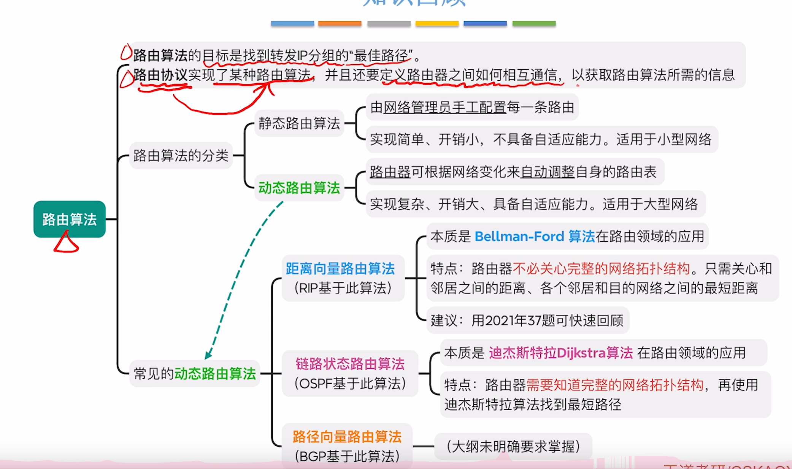

路由协议
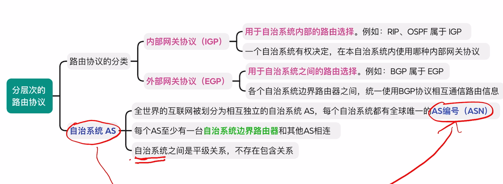
内部网关协议(IGP)一个自治系统内 :RIP  OSPF 
外部网关协议(EGP)不同自治系统之间 :BGP

### RIP(路由信息协议)：
```
应用层协议使用UDP的传送端口*端口520* 适用于小型互联网 
优：实现简单，开销小，收敛过程较快，好消息传得快
缺：网络规模(15)，好消息传得慢
路由表项<目的网络，距离，下一条路由地址>
```
流程图：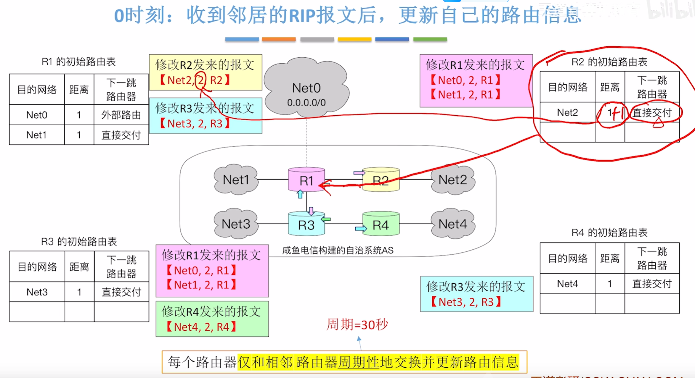
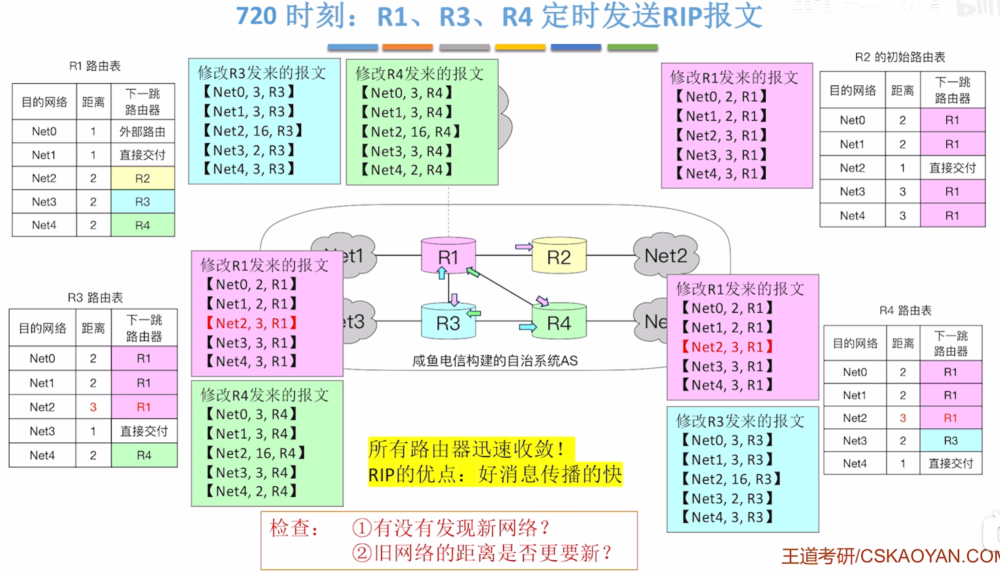

### OSPF(开放最短路径优先)：
```
网络层协议，直接用IP数据报传送(其ip数据报首部的协议字段为89)
通信量可分配给多条相同路径代价的路径
OSPF分组具有鉴别功能(鉴别被黑的或虚假的路由器)  
支持可变长度的子网划分和无分类编址CIDR
每个链路状态都带上一个32位序号，序号越大状态越新
只有链路状态信息发生变化才进行洪泛，发送的是与本路由器相邻的所有路由器的链路状态，是部分信息，而rip传输的是整个路由表
```
``` 
再划分了更小的范围-区域 ，减少了整个网络的通信量， 只有一个区域配置为主干区域，它包含所有区域的边界路由器 
主干区域中和外界通信的路由器--自治系统边界路由器 
 ```
 ```
  本质是一个邻接表 - LAS是链路状态信息  LSDB链路状态数据库 ）----------> 统称为LSI
 分组类型：
 1.问候分组(Hello)  10s发一次，40s没收到立即修改链路状态数据库
 2.数据库描述分组(DBD)
 3.链路状态请求分组(LSR)(要发送来回两次：ExStart阶段 —— 协商主从和初始序列号； Exchange阶段 —— 正式交换数据库摘要（DBD）)
 4.链路状态更新分组(LSU)(只有我洪泛)
 		OSPF 洪泛的规则：
			收到 LSA → 判断是否是新的/比自己LSDB版本新
			如果是新 LSA → 更新 LSDB → 向除来源邻居外的其他邻居转发（洪泛）
 5.链路状态确认分组(LSAck)
 
 ```
 ``` 为了确保链路状态数据库和全网的状态保持一致，每隔一段时间(30分钟)刷新一次数据库链路状态 ```

### BGP(边界网关协议):

``` 并非寻找一条最佳路由 ```
``` BGP 的 AS_PATH、NEXT_HOP 属于路径属性，仅存储在 BGP RIB 中，用于路由优选与防环；普通 IP 路由表只存储最优路由的转发信息，不携带任何 BGP 属性。 ```
```
--采用路径向量路由选择协议，是应用层协议，是基于TCP的
--连个边界路由器采用端口号179的半永生TCP连接（双方交换信息后仍保持连接）
--包括内部BGP对话（iBGP） 和 外部BGP对话（eBGP） -- 不仅可在AS外部也可在AS内部
--路由格式： <CIDR前缀， BGP属性> BGP属性包括AS-PATH(AS号路径) 和 NEXT-HOP
--iBGP默认不修改“下一跳”
--“下一跳”是eBGP发送方路由器自己的IP
--iBGP 不像 eBGP 自动学习邻居，必须在每台路由器上显式声明其他 iBGP 邻居。
```
特点总结：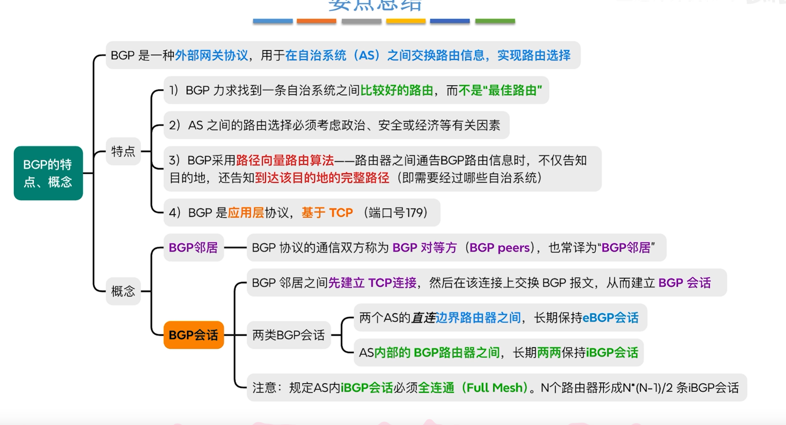
BGP路由信息&工作原理：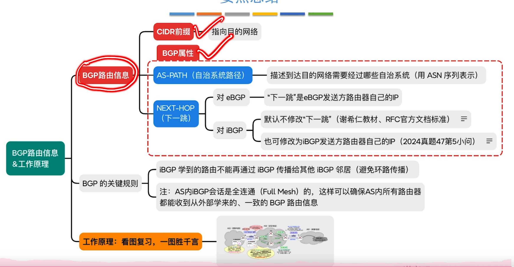

```
路由选择
(1)本地偏好最高  --> (2)选择AS跳数最少 --> (3)使用热土豆路由选择算法（尽快逃离AS） -->  (4)选择BGP标识符的数值最小的路由
```

``` 
BGP四种报文
Open(打开)报文。用来与相邻的另一个BGP对等方(peers)建立BGP会话，使通信初始化
(2)Update(更新)报文。用来通知某一路由的信息，以及列出要撤销的多条路由
(3)Keepalive(保活)报文。用来周期性地通知BGP对等方“我还活着"
(4)Notification(通知)报文。用来发送检测到的错误，并立即关闭BGP会话
```

特点总结：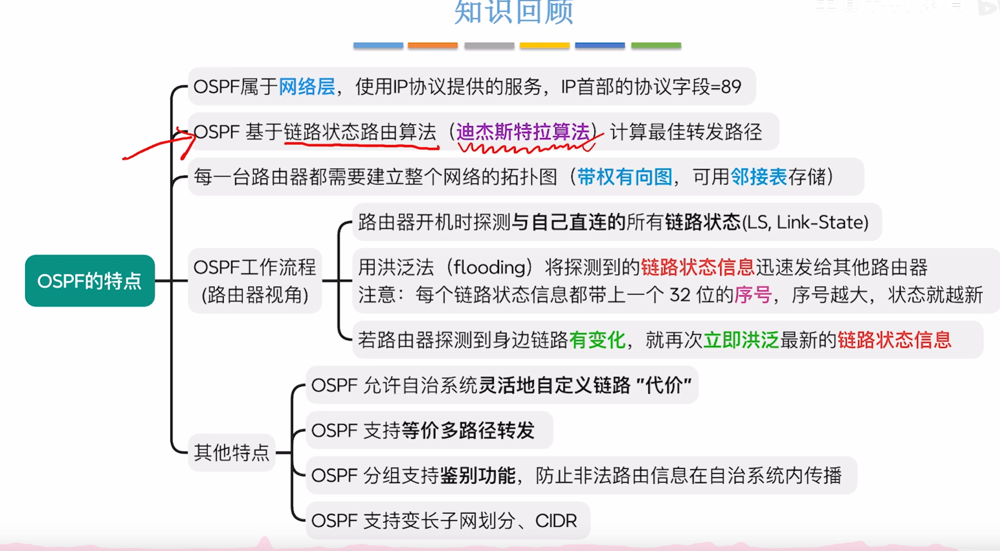
工作原理：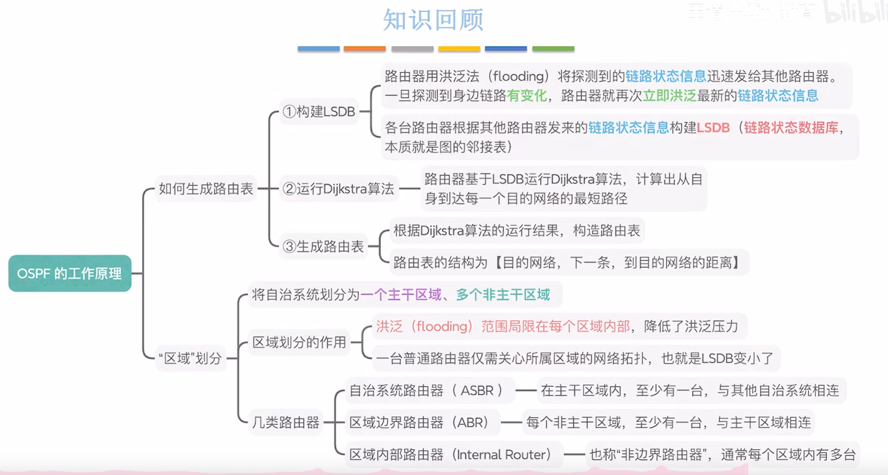
分组类型：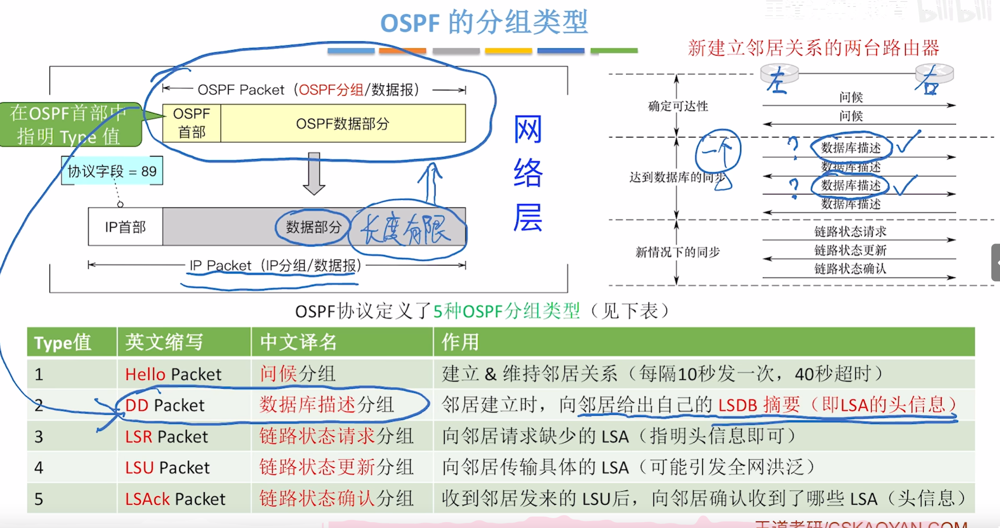
工作原理：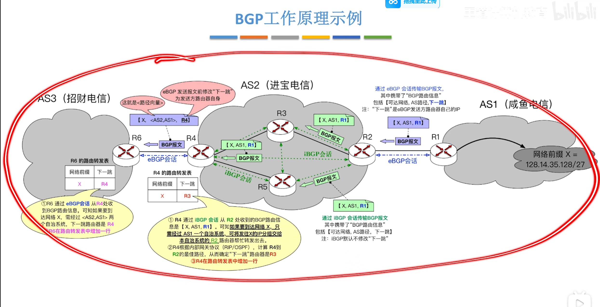
路由选择：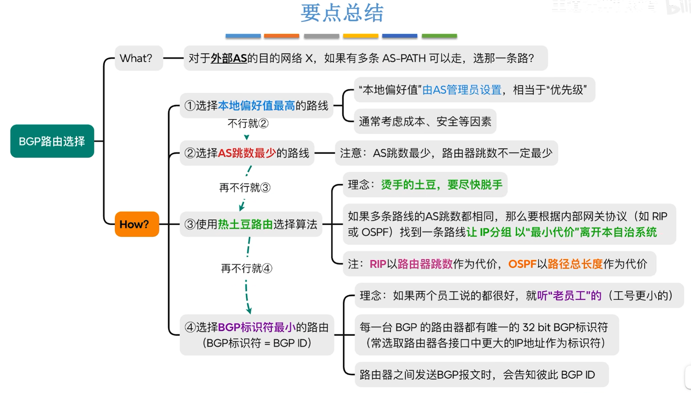


## 4.5 IP 多播
```
和普通IP地址的区别：为D类地址作为目的地址，并且首部中的协议字段为2，表明使用IGMP
应用于UDP
```
```
  局域网内支持硬件多播，能将IP多播地址映射多播MAC地址，封装在MAC帧内 且IP多播地址比MAC多播地址多，会存在一对多的，即多个相同的ip多播地址映射成统一多播MAC地址 -- 32映射成一个MAC地址
```
### IGMP协议
```
路由器要获得多播组的成员信息，需要利用IGMP(网际组管理)协议
是让连接到本局域网的多播路由器知道本局域网上是否有主机退出或加入了某个多播组。
IGMP并不是在互联网范围内对所有多播组成员进行管理的协议。不知道IP多播组包含的成员数，也不知道这些成员分布在哪些网络上
IGMP被封装在ip数据报中传送，也向ip层提供服务。视为整个网际层协议ip的一个组成部分
```

### IGMP工作的两个阶段：
```
	1.一台主机要加入时，主机向多播路由器发送一个IGMP报文，声明自己要成为哪个组的成员。本机多播路由器收到后利用多播路由选择协议，把这种组成员关系发给其他的多播路由器
	2.组成员关系是动态的。周期性的试探本地局域网的主机，只要一个主机回应就认为是活跃的，否则不再把这种组成员关系发给其他的多播路由器
```


## 4.6 移动IP

移动IP通信过程


总结：


## 4.7 网络层设备
```
路由器从结构上看，由路由选择和分组转发两部分构成
注意转发表 != 路由表
<前缀，吓一跳，出接口>
```
传输层设备--路由器：

# 第五章 传输层

## 5.1 传输层提供的服务

应用进程之间的逻辑通信  差错检测   复用分用   提供面向连接和无连接的传输协议
端口号 
服务器端使用的端口号： 熟知端口号0-1023  登记端口号1024-49151
客户端使用的端口号： 49152-65535

套接字(socket)： == （ip地址：端口号）
总结：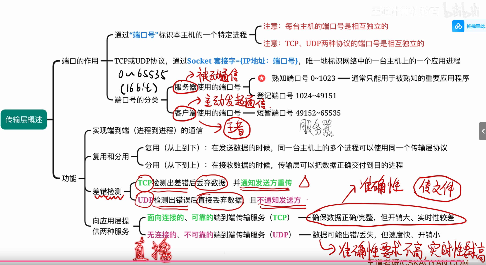

# 5.2 UDP
仅在ip层之上增加了复用、分用和差错检测的功能
```
特点:1、无连接状态(接送发送缓存、拥塞控制参数和序号与确认后)
     2、首部只有8B 3、没有拥塞控制，网络中的拥塞不会影响主机发送速率
		 4、支持一对一、一对多、多对一和多对多的交互通信
```

16位UDP长度包括首部和数据，1B为单位
特点和报文：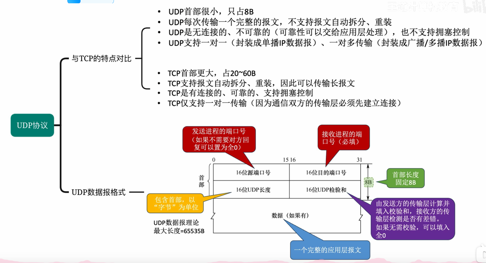
```
常用于一次性传输较少数据的网络应用和多媒体应用 如：DNS、SNMP、视频会议、直播等
不保证可靠，但不意味着应用对数据的要求是不可靠的，交由应用层来完成
面向报文，一次发送一个报文，不合并也不分支，是UDP处理的最少数据单元
```

UDP检验(和TCP基本一样除了伪首部版本和长度的差别，和IP数据报检验也基本一样，但IP只检验首部)
总结：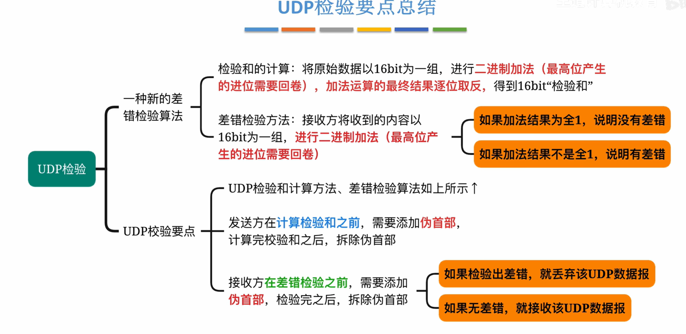 
伪首部(12B)： 4B源ip 4B目的ip 空1B 版本号(17/6)1B UDP/TCP长度2B 


## 5.3 TCP
```
在不可靠的IP层上实现的可靠传输协议
提供全双工通信， 面向字节流的
发送缓存：1.发送应用程序传送给发送方TCP准备发送的数据 2.TCP尚未收到确认的数据 
接收缓存：1.按序到达但尚未被接收应用程序读取的数据 2.不按序到达的数据
```
TCP的报文长度根据接收方给出的窗口值和当前网络拥塞程度来决定， UDP报文长度根据发送用户应用进程决定

TCP报文段：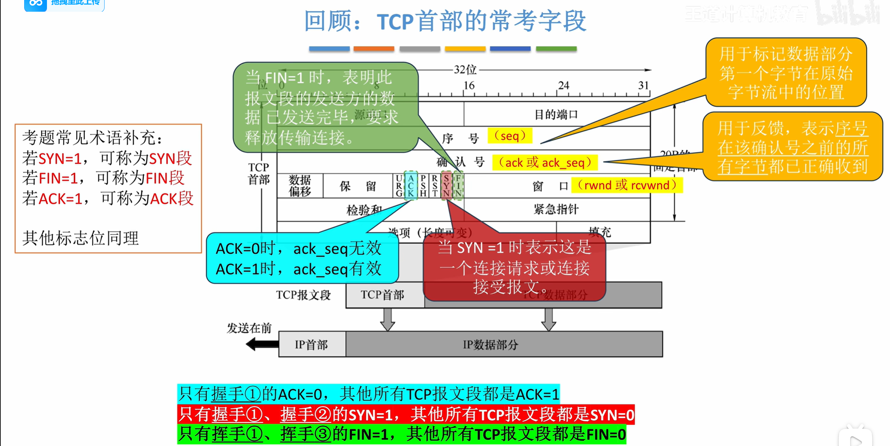
```TCP首部 20-60B
源端口 /目的端口 /序号:4B,不一定从0开始，按字节编号 0-2^32-1 /确认号 4B /数据偏移(首部长度) 4bit 单位为4B /保留 /
紧急位URG(与紧急指针字段配合) /确认位ACK  *除第一次握手是0，其余都是1* /推送位(PSH) 立即响应 
/复位位(释放连接) /同步位(SYN) 表明这是一个连接请求或连接接收报文 *只有握手1，2是1* /终止位(FIN) *只有挥手1，3是1*
/窗口 2B 0-2^16-1 接收方目前允许接收的数据量 /检验和 /紧急指针(即使窗口为0，也能发送紧急数据) /选项 MSS最大报文段长度
```

### 三次握手：
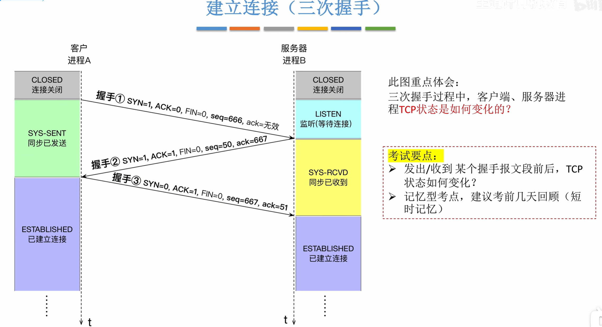
握手1，2不携带数据，但仍要消耗一个序号，握手3如果没携带数据不消耗
TCP连接管理总结：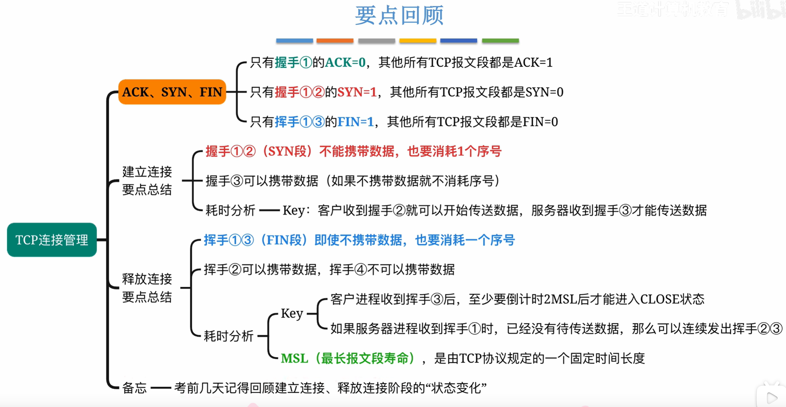

### 四次挥手：
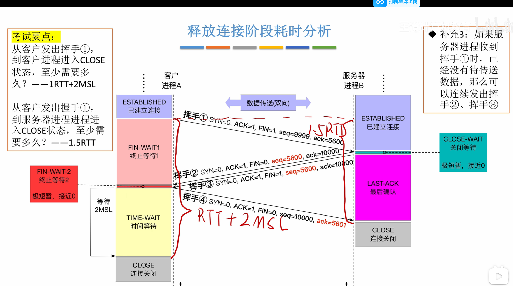
挥手1，3即使不携带数据也要消耗一个序号

### TCP可靠传输
总结: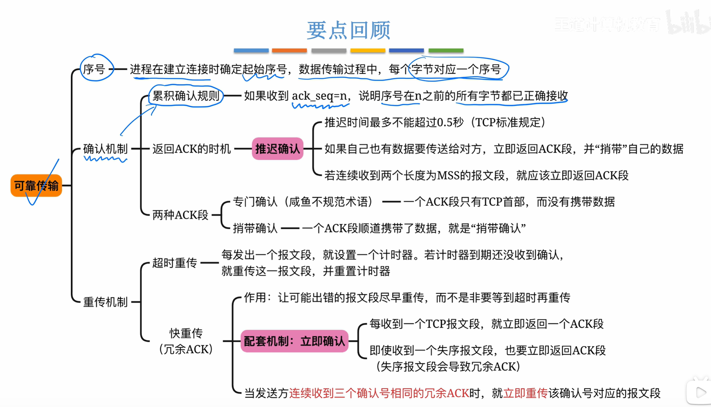
TCP默认使用累计确认  重传：超时/冗余ACK

### 流量控制：
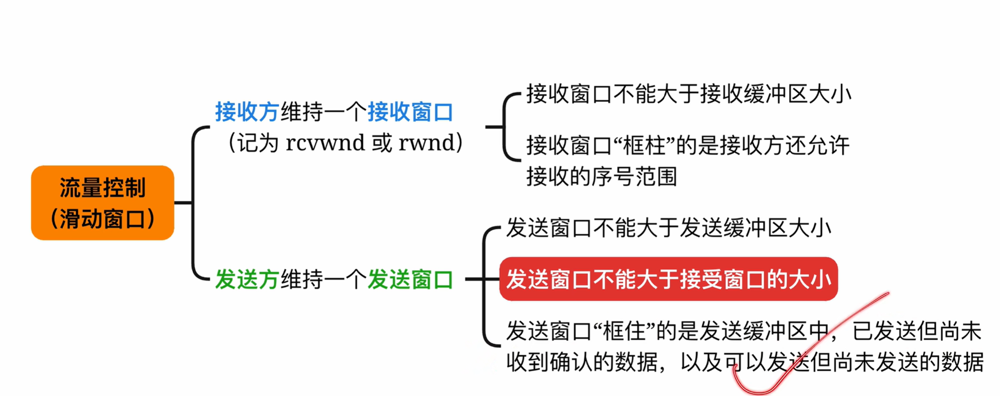
```
rwnd >= 发送窗口
TCP为每个连接设有一个持续计时器，只要收到接收方窗口为0的信息就启动，若超时就发送一个
发送窗口 = min(接收窗口,拥塞窗口)
```
```tips:MSS通过三次握手在报文选项中计算得出，是min（接收，发送），此后TCP将以MSS的大小对报文段进行分割发送```

### TCP拥塞控制：
四种算法：
慢开始，拥塞避免，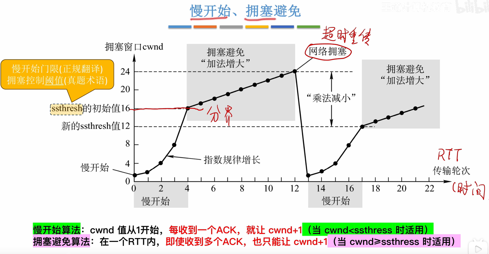 
快重传，快恢复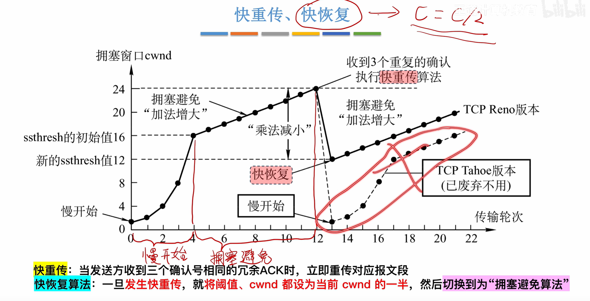


## 6.2 域名系统

四类域名服务器：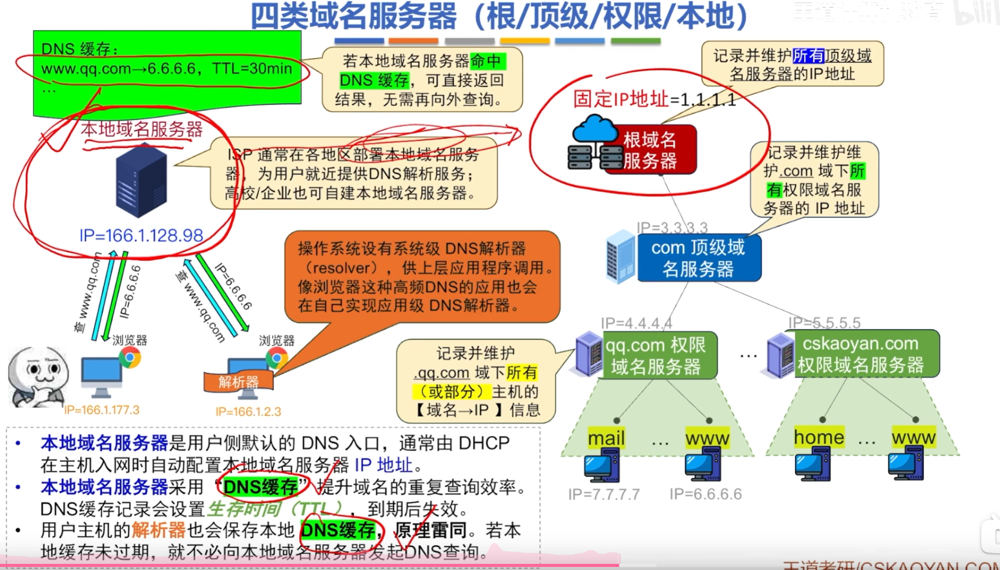
总结：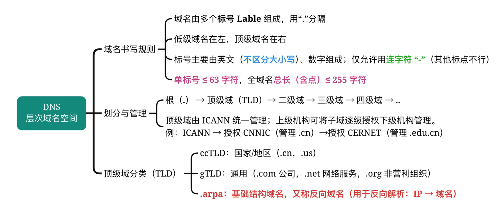

## 6.3 FTP(文件传输协议) 
### 功能
```
使用TCP
  提供不同种类主机系统之间的文件传输能力
	以用户权限管理的方式提供用户对远程FTP服务器上的文件管理能力
	以匿名FTP的方式提供公用文件共享的能力
```
### 工作流程
```
一个FTP服务器可同时为多个客户提供远程服务
端口 *21(控制端口)*--> 服务器端控制进程   端口 *20(数据传送)*--> 主动模式下服务器端的数据传送进程
FTP服务器必须在整个会话期间保留用户的状态信息，服务器必须把指定的用户账户与控制联系起来，服务器必须追踪用户在远程目录树上的位置
```
主动模式(PORT)工作原理：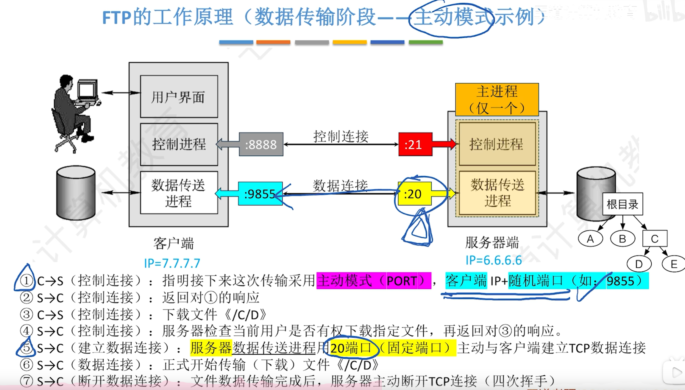
被动模式(PASV)工作原理：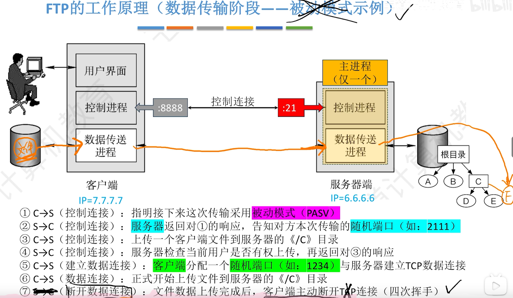 

```
因为FTP使用了一个分离的控制连接，所以也称FTP的控制信息是带外传送的
NFS(网络文件系统) 也许进程打开一个远程文件，并能在该文件的特定位置开始读写数据，减少了大文件之间的来回传送
```

总结 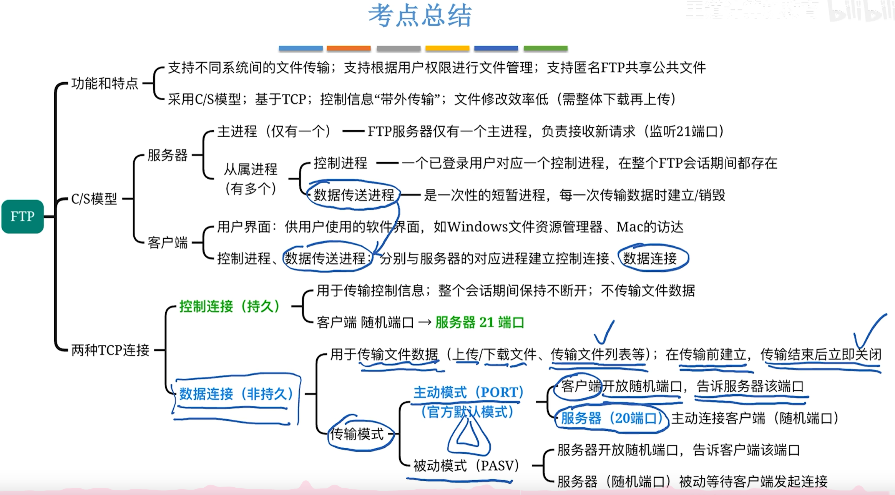

## 6.4 电子邮件
```
一种异步通信方式
(撰写、显示和邮件处理)
        |
				V
       用户代理  --  邮件服务器 -----------邮件服务器  --  电子邮件使用协议
               SMTP(push)         SMTP               POP(pull)
电子邮件： 分 信封/内容
MIME(多用途因特网邮件扩展)：因为SMTP只能传送7位ASCII码文件邮件，很多其他语言无法发送
  MIME并未改动SMTP或取代它，当邮件中含有非ASCII码时就要通过MIME进行转换
	包括：5个新的邮件首部字段  许多邮件内容的格式  定义了传送编码
```

### SMTP(简单邮件传输协议)
```
采用TCP连接 端口号为 *25*
邮件建立
SMTP发送方邮件服务器每隔一定时间对邮件缓存扫描一次，发现邮件就与接收方的邮件服务器建立TCP连接
连接建立后，接收方SMTP服务器发出220Service ready(服务就绪),然后 客户 向 服务器 发送HELO命令，附上发送方的主机名
邮件传送
从MAIL(后面有发送人的地址)开始，若准备好接收就发送250 OK， 下面跟着一个或多个RCPT命令(弄清接收方是否做好接收的准备),若OK就使用DATA命令
连接释放
客户发送QUIT命令，服务器返回221(服务器关闭)
```

### POP3(邮局协议) 和 IMAP(因特网报文读取协议)
```
POP3 端口号为 *110*  有下载并保留 和 下载并删除功能
IMAP 为用户提供了创建文件夹，在不同文件夹之间移动邮件及在远程文件夹中检查邮件等功能 因此IMAP服务器维护了用户的状态信息，也许用户代理只获得报文的某些内容 非常适合低带宽的情况
基于万维网的电子邮箱(Hotmail,Gmail等) :用户浏览器与这些邮件服务器之间的邮件发送或接收使用的是HTTP，而仅在不同邮件服务器之间才使用SMTP
```
SMTP 和 POP3 区别 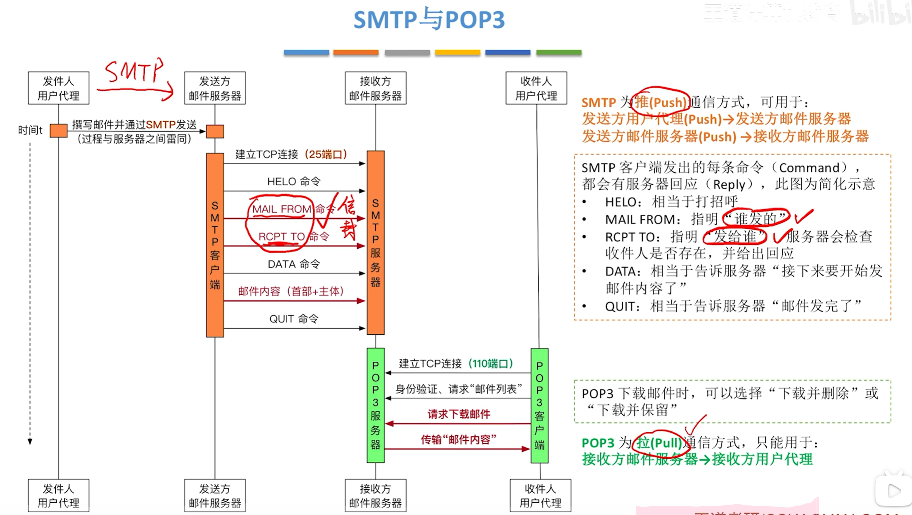

总结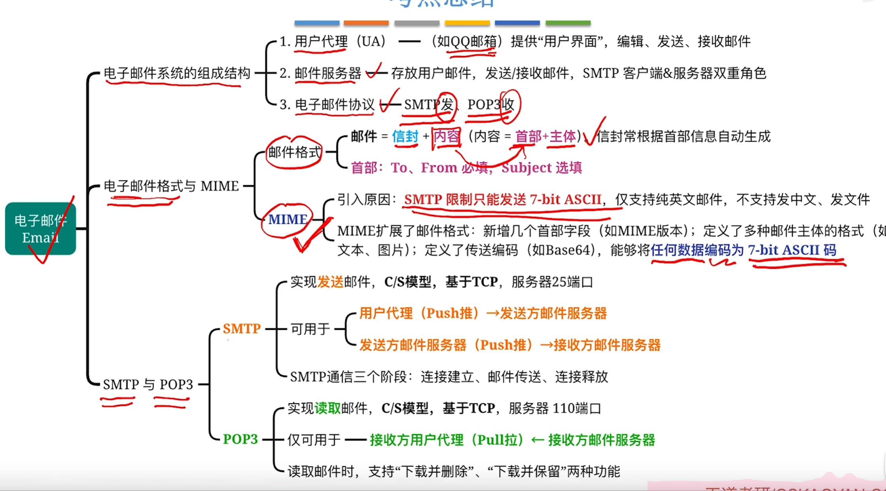

## 6.5 万维网
```
www是一个 *分布式、联机式* 的信息存储空间 ( 包含资源，并由一个全域统一资源定位符（URL）
     标识,这些资源通过http传送给使用者，而后者通过单击链接来获取资源 )                      （客户/服务器模式）
		 内核部分：统一资源定位符（url），超文本传输协议（http），超文本标记语言（html）
每个万维网都有一个服务器进程，不断监听TCP的*端口80*
```
```
http本身*是无连接的*，使用了TCP连接
http是*无状态的*，也就是说服务器没有记忆，但可通过Cookie识别码：（以此为索引在后台数据库建立一个项目）来记录用户的活动记录
*非持续连接*(http/1.0):每个网页元素对象的传输都需要单独建立一个TCP连接   没请求一个对象 ：2*RTT + 传输时间
*持续连接*(http/1.1)： 非流水线 每个对象都有 1*RTT 延迟
						 流水线  引用所用对象才 1 * RTT
```
http协议工作方式:            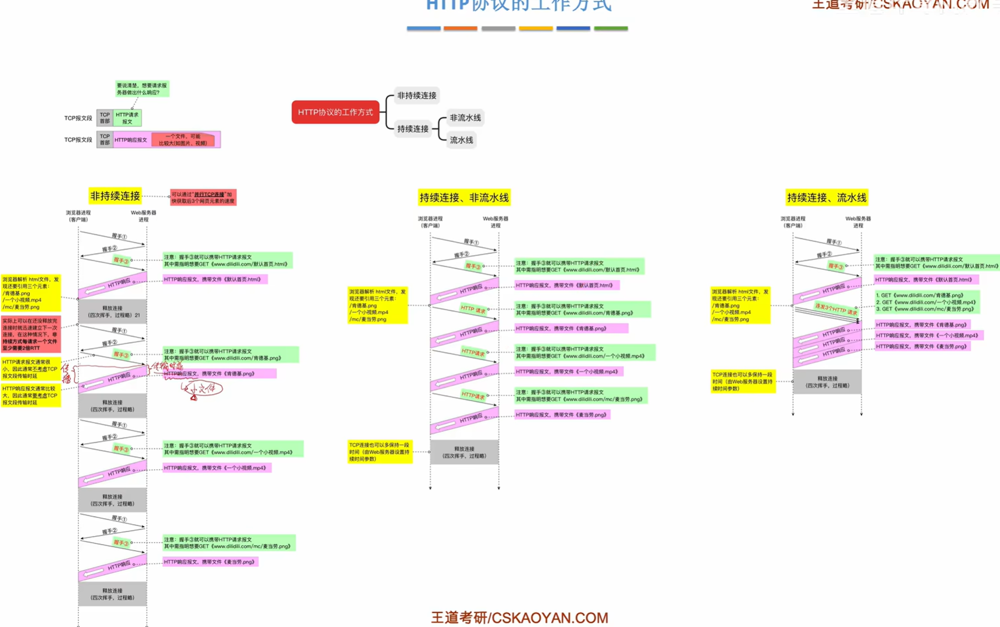
HTTP是面向文本的，因此报文中每个字段都是一些ASCII码串，且长度不固定
http请求和响应报文格式:           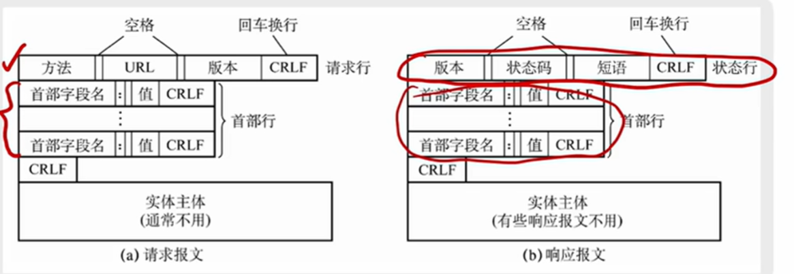 connection：close
常见方法 get head post(向服务器发送待处理数据)

总结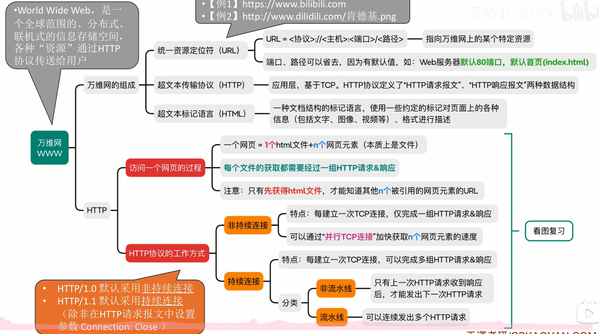

小tips:
对于源端口为80的发送到NAT路由器的报文一定是发给内网主机的http响应（因为一定是http响应报文嘛，那如果是外网的请求报文肯定会经过NAT路由器的）

